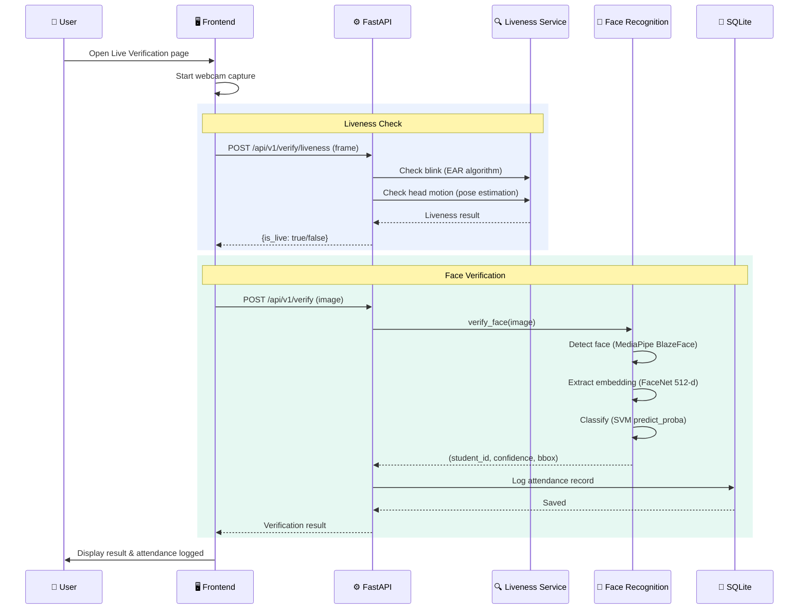
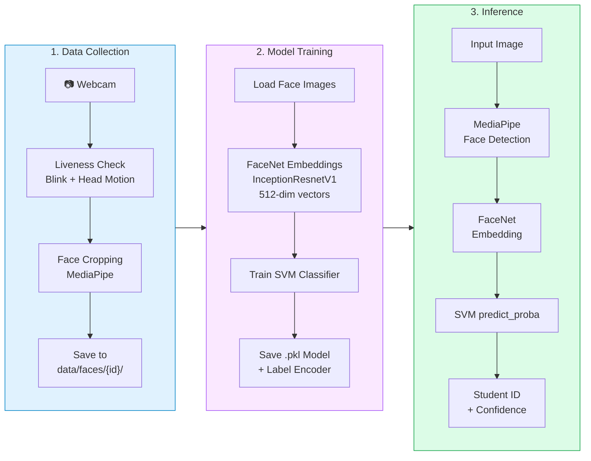

# 🏗️ Smart Attendance System — Architecture Diagram

## High-Level System Architecture


---

## Data Flow — Attendance Verification



---

## ML Pipeline Flow



---

## Tech Stack Summary

| Layer | Technology |
|-------|-----------|
| **Frontend** | React 18, Vite, TailwindCSS, React Router, Axios |
| **Backend** | Python, FastAPI, Uvicorn, SQLAlchemy |
| **Database** | SQLite |
| **Face Detection** | MediaPipe BlazeFace (TFLite) |
| **Face Embedding** | FaceNet-PyTorch (InceptionResnetV1, VGGFace2) |
| **Classifier** | scikit-learn SVM (RBF kernel) |
| **Liveness** | MediaPipe Face Landmarker (EAR blink + head pose) |
| **Auth** | JWT Bearer Tokens, bcrypt hashing |

---

## Directory Structure

```
smart-attendance-system/
├── frontend/                      # React + Vite SPA
│   ├── src/
│   │   ├── App.jsx                # Router & layout wrapper
│   │   ├── pages/
│   │   │   ├── Dashboard.jsx      # Stats overview
│   │   │   ├── Registration.jsx   # Student registration + face capture
│   │   │   ├── LiveVerification.jsx # Live attendance marking
│   │   │   └── Attendance.jsx     # Attendance reports
│   │   ├── components/
│   │   │   ├── Sidebar.jsx        # Navigation sidebar
│   │   │   └── StatsCard.jsx      # Reusable stat display
│   │   ├── layouts/
│   │   │   └── DashboardLayout.jsx
│   │   └── services/
│   │       └── api.js             # Axios instance + JWT interceptor
│   └── package.json
│
├── backend/                       # FastAPI server
│   ├── app/
│   │   ├── main.py                # App entry, CORS, router includes
│   │   ├── api/v1/
│   │   │   ├── auth.py            # Login / register endpoints
│   │   │   ├── students.py        # Student CRUD
│   │   │   ├── verify.py          # Face verification endpoint
│   │   │   ├── attendance.py      # Attendance records API
│   │   │   ├── dashboard.py       # Dashboard stats API
│   │   │   └── model.py           # Model training trigger
│   │   ├── core/
│   │   │   ├── config.py          # App settings
│   │   │   ├── database.py        # SQLAlchemy engine & session
│   │   │   ├── security.py        # JWT creation & password hashing
│   │   │   ├── dependencies.py    # Auth dependency injection
│   │   │   ├── face_recognition.py# FaceRecognizer (detect + embed + classify)
│   │   │   └── liveness/
│   │   │       ├── service.py     # LivenessService orchestrator
│   │   │       ├── blink_detector.py  # Eye Aspect Ratio algorithm
│   │   │       └── motion_detector.py # Head pose estimation
│   │   ├── models/
│   │   │   ├── user.py            # User ORM model
│   │   │   ├── student.py         # Student ORM model
│   │   │   └── attendance.py      # Attendance ORM model
│   │   └── schemas/               # Pydantic request/response schemas
│   ├── sql_app.db                 # SQLite database file
│   └── requirements.txt
│
├── scripts/                       # Standalone ML utilities
│   ├── collect_faces_with_liveness.py
│   ├── data_acquisition.py
│   ├── train_model.py
│   └── real_time_recognition.py
│
├── models/custom/                 # Trained model artifacts
│   └── svm_face_classifier.pkl
│
└── data/faces/                    # Face image dataset
```
